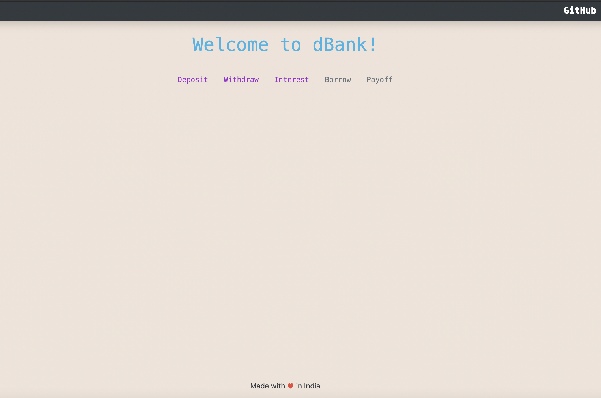

## Professional Portfolio
---
### Blockchain | Ethereum
[Instant Crypto Exchange Dapp - Smart contracts](https://itznishant.github.io/CryptoExchangeDapp)
 

---
[DeFi (Decentralised Finance) Bank](https://itznishant.github.io/dBank/)
 

---
[Crypto Token Sale ICO DAPP](https://itznishant.github.io/SASITokenDAPP)
 

---
### Data Science | Machine Learning

- [Document Classification - ML, Python](https://www.linkedin.com/pulse/ectd-document-classification-using-machine-learning-vemulakonda)
- [Geo spatial Analysis - Capstone ML, Python](https://www.linkedin.com/pulse/hyderabad-neighborhood-analysis-capstone-project-vemulakonda)
- [Customer Churn Analysis Retail firm ML, Python](https://github.com/itznishant)
- [Stock Analysis Using Python](https://github.com/itznishant/Stock-Analysis-NSE-Using-Python)

---

Page template forked from <a href="https://github.com/evanca/quick-portfolio">evanca</a>

<!-- Remove above link if you don't want to attibute -->
